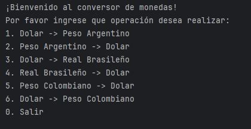

# Conversor de monedas
### Proyecto Java para convertir montos de una moneda a otra.

Aquí puedes observar como funciona el conversor a través de capturas de pantalla y un video mostrando un ejemplo de uso.

### Mensaje de bienvenida con las opciones de operación:

### Muestra de los resultados por pantalla y mensaje de finalización del programa:

### Video demostrativo del funcionamiento del programa:

